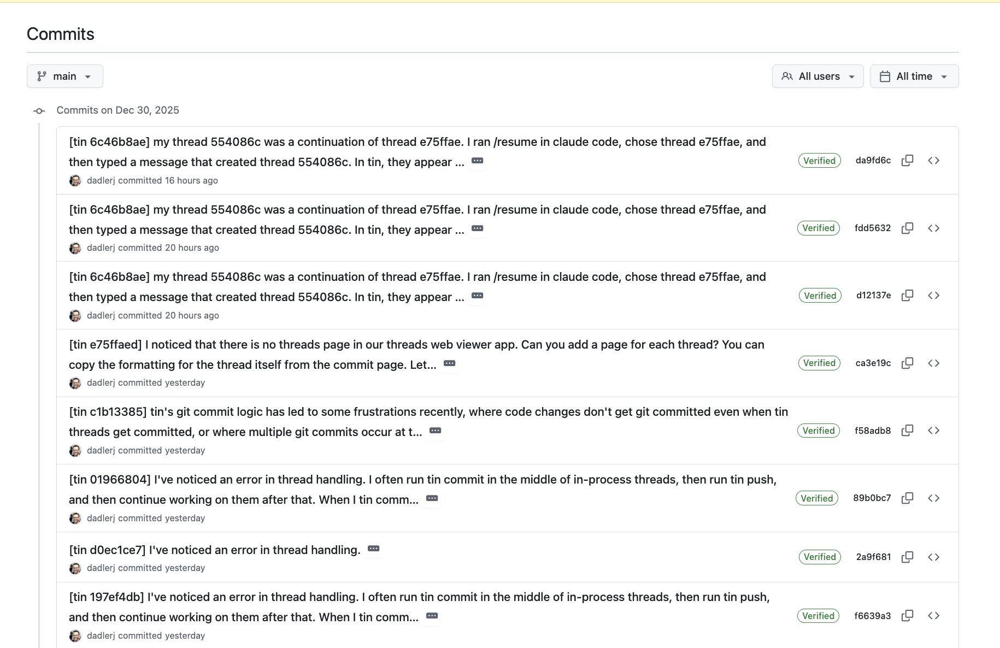

# tin

[](https://opensource.org/licenses/Apache-2.0) 

Thread-based version control for conversational agentic coding. Wraps git, treating conversation threads as the primary unit of change.

***

**WARNING:** This is a proof of concept, 100% vibe coded (this README.md is the only human-edited file in this repo!), and may not be suitable for all agentic coding workflows. See [contributing](#contributing) below if you want to support this project.

***

## Highlights

- **Thread-based version control**: `tin` is a version control protocol and application for conversational agentic coding. It treats conversation threads as the primary unit of change, and provides a structural link between them and code changes (i.e., git commits).

- **Git integration**: `tin` is built on top of git and fully replaces it in your agentic coding workflow. It manages your git state for you; all you worry about is which conversations (and associated changes) should be committed. See [all commands](COMMANDS.md).

- **Built for vibe coding**: `tin` is designed to be used by devs and teams that do 95%+ of their coding via agents. Manual code edits and git operations are possible, but break the threads-as-source-of-truth model.

- **Collaborative**: `tin` provides a central repository of the conversations across your whole team, a single record of the team's decisions.

## Why `tin`

Git retains the history of changes to the codebase. 

`tin` retains the human thoughts behind the code, the history of decisions that led to the code, and the provenance of the code.

For the first time, developers that use coding agents are forced to write down the _thoughts_ behind their code before that code is written. But those thoughts only live in local agent caches today (and proprietary, fractured web services). `tin` is the first version control system to capture and preserve those thoughts _and_ how they resulted in the code's changes, for an entire development team.

## Quickstart

```bash
go install github.com/dadlerj/tin/cmd/tin@latest

tin init                        # Initialize in a git repo
tin hooks install               # Set up Claude Code integration
claude                          # ... have a conversation in your agent of choice
tin status                      # See pending threads
tin commit -m "Added feature"   # Commit threads + code together
```

## Getting started and the `tin` workflow

1. **Download and install `tin`, and initialize your repository**

Run `go install github.com/dadlerj/tin/cmd/tin@latest`

Run `tin init` in your git repo.

2. **Install your agent's `tin` bindings**

Today, `tin` only integrates with Claude Code. Run `tin hooks install` (with or without the `-g` global flag) to install hooks and slash commands for Claude Code.

3. **Code as normal in your agent**

`tin` will automatically track your conversations and code changes.

4. **Stage and commit your changes using `tin`**

Instead of `git add` and `git commit`, use `tin add` and `tin commit`.

Push your changes to a `tin` remote (see `tin serve`) if you want to collaborate or backup your history. `tin push` and `tin pull` are supported. See more in the command documentation.

5. **That's it! :tada:**

`tin` will automatically track your agent conversations (and all versions of them, as they change) and the code changes associated with each one.

### `tin` server and web viewer

`tin` ships with a `tin serve` command that starts a remote server that can accept `tin push`es and `tin pull`s. Use `tin remote` to point to the remote server.

`tin` also provides a simple web viewer to see tin repositories, commits, and threads. Run `tin serve --web --port 8080` to view it.

**The tin web commits page**


**The tin web thread page**


### `tin` in git

All `tin` commits are connected to git commits (if the git commit hash for a tin commit changes, the tin commit hash will as well). All git commits link back to the `tin` threads that created them.

**tin in GitHub**



## Why the name "`tin`"?

>"I'm an egotistical bastard, and I name all my projects after myself. First Linux, now **git**."

\- Linus Torvalds

>**tin can**: (informal, sometimes derogatory) A nickname for a robot or artificial intelligence.
>
>_Do as you’re told, tin can!_

\- [Wiktionary](https://en.wiktionary.org/wiki/tin_can)

## Contributing

`tin` is a proof of concept, 100% vibe coded, and may not be suitable for all agentic coding workflows. 

I am not a professional developer and this was a holiday hobby project. If `tin` gets adopted, I fully intend to contribute it to an open source foundation. If you are interested in becoming a maintainer, please let me know.
